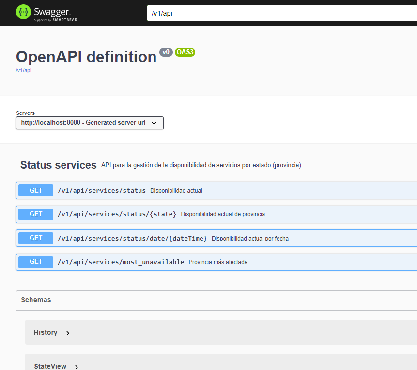
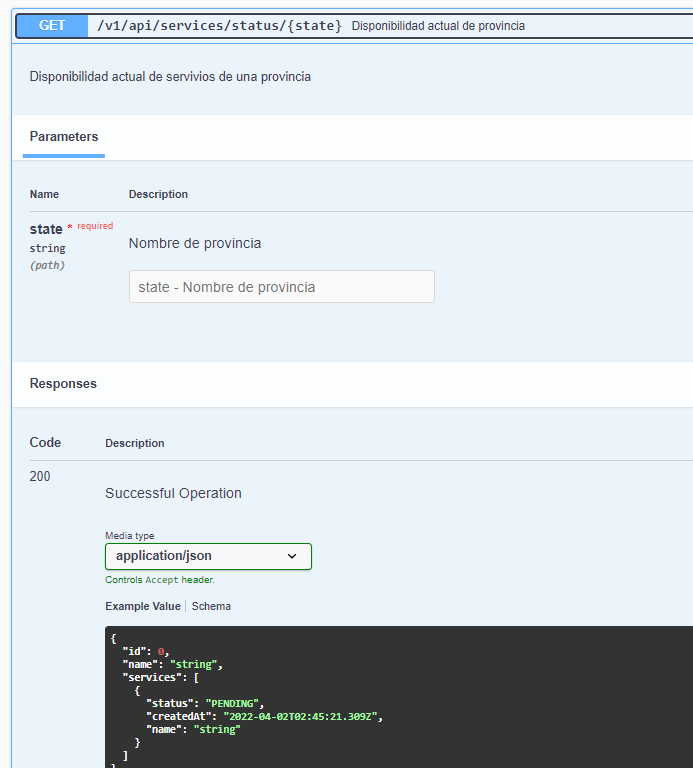

# Demo Api Rest con Java


## Description

Ap rest desarrollada para fines demostrativos y prácticos con Spring Boot Framework y Mysql, donde se plantean los siguientes requisitos:

- Cargar disponibilidad de los servicios por estado (provincia) publicados en la web : http://www.nfe.fazenda.gov.br/portal/disponibilidade.aspx y almacenar historial.

- Repetir carga cada X segundos

- Obtener disponibilidad de todos los servicios por provincia

- Obtener disponibilidad actual de servicios de una provincia indicada

- Obtener disponibilidad de servicios por provincia de una fecha indicada

- Obtener Provincia que tuvo mas afectaciones de servicios

- Utilizar [Swagger](https://swagger.io/) para describir las operaciones que estarán disponibles en el API.

- (Pendiente) Utiliza [JWT](http://jwt.io) con [Passport](http://passportjs.org) como estrategia de autenticación

- (Pendiente) Se deben desarrollar test automáticos.

## Desarrollo

- Se crean modelos con relaciones: [Provincia](src/main/java/bz/nimitz/ybr/demo/model/State.java), [Servicio](src/main/java/bz/nimitz/ybr/demo/model/Serv.java), e [Historial](src/main/java/bz/nimitz/ybr/demo/model/History.java), para gestionar la disponibilidad de los estados por provincias y fechas.

- Se crean repositorios JPA (Java Persistence API) para el acceso a los datos [Provincias](src/main/java/bz/nimitz/ybr/demo/repository/StateRepository.java), [Servicios](src/main/java/bz/nimitz/ybr/demo/repository/ServRepository.java), e [Historial](src/main/java/bz/nimitz/ybr/demo/repository/HistoryRepository.java)

- Para cargar y leer html de una web externa se utiliza la libreria p [jsoup](https://jsoup.org/) en un [Servicio::loadDataFromWeb](src/main/java/bz/nimitz/ybr/demo/service/MyService.java) que se ejecuta cada N segundos [ScheduledTasks](src/main/java/bz/nimitz/ybr/demo/ScheduledTasks.java)

- Se crea un Controlador de Excepciones [CustomExceptionHandler](src/main/java/bz/nimitz/ybr/demo/Utils/CustomExceptionHandler.java) para manejar el error [RecordNotFoundException](src/main/java/bz/nimitz/ybr/demo/Utils/RecordNotFoundException.java)

- Se crea la documentación del [api](src/main/java/bz/nimitz/ybr/demo/controller/MyControllerApi.java)  con la libreria [Springdoc](https://springdoc.org/) 


## Implementación de la solución

1. Clonar repositorio: https://github.com/yurisnel/java-api-rest
2. Descargar dependencias:

```bash
$ ./gradlew dependencies
```

3. Ejecutar aplicación:

```bash
$ ./gradlew bootRun
```

4. Abrir api doc en navegador en: http://localhost:8080/apidoc.html





**PD:** Esta Api Rest es utilizada por el proyecto https://github.com/yurisnel/angular13-api-client
